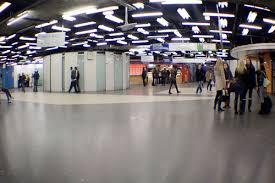

Projet : Simulateur de Foule
===

Quelques liens supplémentaires
-----------------------------------------
+ [page wikipedia](https://fr.wikipedia.org/wiki/Simulation_de_foule)
+ [Images des mathématiques](http://images.math.cnrs.fr/Modelisation-de-mouvements-de.html?lang=fr)
+ [une belle page perso de chercheur](https://www.staff.science.uu.nl/~gerae101/UU_crowd_simulation_software.html)

Cadre a modéliser et exemples
--

+ salle des pas perdus, RER chatelet/les halles
+ entrée dans une porte, deviation par un obstacle

Principe du modèle
--
+ Sur une carte 2D des voyageurs sont en transit
+ Chaque voyageur possède un point d'origine et un point de destination
+ Les voyageurs voient le terrain autour d'eux mais n'en n'ont pas une connaissance parfaite.
+ Chaque voyageur va éviter les collisions avec les objets fixes et les objets mobiles (les autres voyageurs)
+ Le comportement et les caractéristiques de chaque voyageur peuvent être différents
+ Modalités : carte "continue" ou discrète (par exemple damier), forme(s) des voyageurs (cercles, carrés, etc), voyageurs orientés ou non...

Suggestions pour le modèle
--
+ Modèle "tout par tour"
Boucle principale : (sur un intervale de temps court)
> Tant que (en cours):
>>    pour tout voyageur v
>>>  v observe son environnement
v décide un mouvement
v exécute son mouvement
+ On peut aussi décider de faire les mouvement simultanés mais les collisions seront plus délicates à gérer

Suggestions pour l'implémentation
--
+ **orienté objet**  pour :  *abstraction*, *modularité* et *encapsulation*

+ modularité :
>+  il est facile d'ajouter de nouvelles fonctionnalités 
> + changer les fonctionnalités existantes sans toucher au reste

 
+ Options du programme :
   chargement / sauvegarde / modification de la map
 calcul de statistiques, vitesse moyenne, densité, rapport aux plus courts chemins
comportement alternatif : suivre un autre voyageur 

Implementation
--

**Objectif** :  créer le modèle comme un ensemble d'objets en interaction qui pourront ensuite être observés et représentés par l'interface graphique.

**PAS D'INTERFACE GRAPHIQUE LE PREMIER JOUR**

Classes pour les individus, la map, etc.
Ex :
>Class Voyageur:
>> champs :
>>>  position
       direction (?)
       portée de vision
       
>>methodes
>>> observation
>>> deplacement
        
        
        
Class Carte

Comment gérer les positions efficacement pour détecter les collisions  ? Passage à l'échelle sur le nb de voyageurs

Comment gérer la liste / ensemble de voyageurs ?

